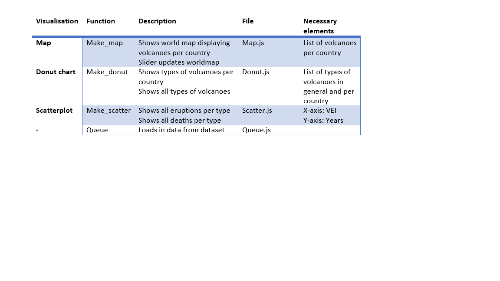

# Design

## Data source
<ul>
<li>https://www.ngdc.noaa.gov/nndc/servlet/ShowDatasets?dataset=102557&search_look=50&display_look=50</li>
</ul>

The dataset shows data of all volcano eruptions around the world in chronological order (from -4360 until 2018). For the purpose of this project only the name of the volcano, location (country), year of eruption, type, the Volcanic Explosivity Index (VEI) and the number of deaths are relevant. This information will be inserted into a new dataset which will be used for this project. The filtered dataset also contains the longitude and latitude of the volcanoes, the status and whether the eruption caused an earthquake or tsunami. However this data will initially not be used and possibly will take part in an extension of this project. The data is provided in a CSV file and will be converted to JSON by the program written in convertCSV2JSON.py. After loading in the data, a program written in queue.js will process the data and categorize it as follows:

<ul>
<li>volcanoes which are located in the same country (map)</li>
<li>percentage of types of volcanoes in a country (donut chart 2) </li>
  <li>percentage of types of volcanoes in the world (donut chart 1)</li>
  <li>the sum of eruptions specific for a type of volcano per year (scatterplot 1)</li>
  <li>the sum of deaths specific for a type of volcano per year (scatterplot 2) </li>
</ul>

## Diagram

## D3 plug ins

<ul>
<li>D3-geomap</li>
  <li>D3-tooltip</li>
  <li>Billboard.js</li>
  <li>D3plus</li>
  <li>D3-slider</li>
  <li>D3-queu</li>
  </ul>

