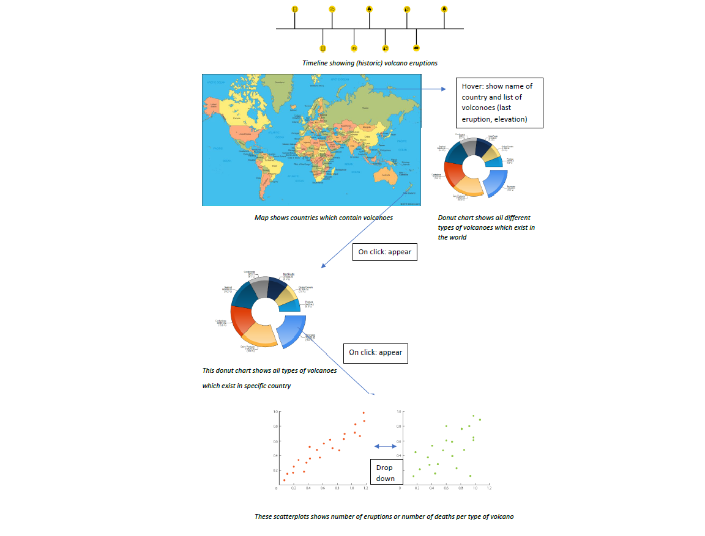

# programmeerproject
This project will visualize all the vulcanoes in the world and answer the question whether there is a correlation between types of  vulcanoes and the number of eruptions and possibly the number of deaths. 

## Sketch

## Main features
The main features of this project are the countries, the name and type and of the volcanoes, the number of eruptions and the number of deaths. This are also the minimum viable product. The first screen will contain the map, the donut chart which shows all existing types of volcanoes. The first interactive element will be a slider which provides the user to slide through years and as a result the country in which a volcano has erupted in that specific year will light up. Clicking on a country in the map, a donutchart will appear that shows all types of volcanoes in that specific country. By clicking on a type of volcano in the donut chart, a scatterplot will appear. This scatterplot shows years on the x-axis and the Volcanic Explosivity Index on the y-axis. This scatterplot will visualize the sum of eruptions of a specific type of volcano per year. By using a dropdown (the second interactive element), it is possible to see the number of deaths per type of volcano instead of the number of eruptions. Hopefully, this will provide an answer to the question whether there is a correlation between types of vulcanoes and the number of eruptions and the number of deaths.

## Data sources
Data will be obtained from http://volcano.si.edu/list_volcano_holocene.cfm and https://www.ngdc.noaa.gov/nndc/servlet/ShowDatasets?dataset=102557&search_look=50&display_look=50. The obtained data must be transformed into JSON objects before use.

## External components
Libraries that need to be included are d3 and d3-tip. 

## Harders part
The hardest part of this project will be to prepare the data for use and to make clear visualisations.
